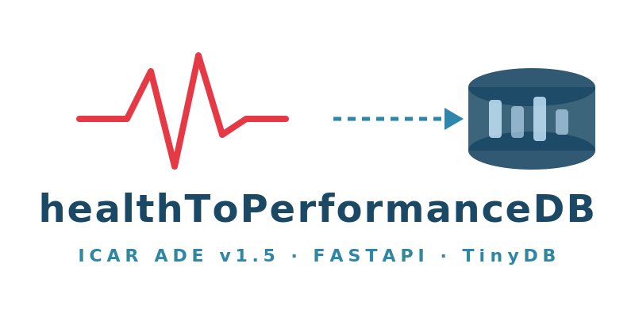

<p align="center">
  
</p>

# healthToPerformanceDB

API REST basada en **FastAPI + TinyDB** que implementa el modelo de datos **ICAR Animal Data Exchange (ADE) v1.5** para operaciones CRUD sobre recursos ganaderos: animales, eventos de peso, sanitarios, movimientos, reproducción, ordeño y agrupaciones.

## Stack

| Componente | Versión |
|-----------|---------|
| Python | 3.11+ |
| FastAPI | 0.111+ |
| Pydantic | 2.x |
| TinyDB | 4.8+ |
| Uvicorn | 0.30+ |

## Instalación

```bash
pip install -r requirements.txt
```

## Ejecución

```bash
# Desarrollo con hot-reload
uvicorn app.main:app --reload

# O mediante script
python run.py
```

## Carga de semilla

```bash
python seed_data.py
```

Inserta 17 recursos de ejemplo: nacimiento de ternera → ficha animal → peso neonatal → tratamiento por diarrea → agrupación → pesada de grupo → celo → inseminación → diagnóstico de gestación → ordeño → alerta → alimentación → dispositivo → medicamento → ubicación.

## Documentación interactiva

| Recurso | URL |
|---------|-----|
| Swagger UI | http://localhost:8000/docs |
| ReDoc | http://localhost:8000/redoc |
| Healthcheck | http://localhost:8000/healthcheck |
| OpenAPI JSON | http://localhost:8000/openapi.json |

## Uso con curl

### Animales

```bash
# Crear animal
curl -X POST http://localhost:8000/animals \
  -H "Content-Type: application/json" \
  -d '{
    "identifier": {"scheme": "es.magrama.bovine", "id": "ES091234567890"},
    "specie": "Cattle",
    "gender": "Female",
    "birthDate": "2026-03-15T08:00:00Z",
    "location": {"scheme": "es.rea", "id": "ES430000001"},
    "primaryBreed": {"scheme": "es.rae", "id": "LIM"},
    "managementTag": "T-001",
    "productionPurpose": "Milk"
  }'

# Listar animales
curl http://localhost:8000/animals

# Obtener animal por identificador
curl http://localhost:8000/animals/es.magrama.bovine/ES091234567890

# Actualizar animal
curl -X PUT http://localhost:8000/animals/es.magrama.bovine/ES091234567890 \
  -H "Content-Type: application/json" \
  -d '{"identifier": {"scheme": "es.magrama.bovine", "id": "ES091234567890"}, "specie": "Cattle", "gender": "Female", "name": "Luna"}'

# Actualización parcial
curl -X PATCH http://localhost:8000/animals/es.magrama.bovine/ES091234567890 \
  -H "Content-Type: application/json" \
  -d '{"healthStatus": "Healthy"}'

# Eliminar animal
curl -X DELETE http://localhost:8000/animals/es.magrama.bovine/ES091234567890

# Eventos de un animal
curl http://localhost:8000/animals/es.magrama.bovine/ES091234567890/events
```

### Eventos

```bash
# Crear evento (cualquier tipo)
curl -X POST http://localhost:8000/events \
  -H "Content-Type: application/json" \
  -d '{
    "resourceType": "icarMovementBirthEventResource",
    "animal": {"scheme": "es.magrama.bovine", "id": "ES091234567890"},
    "location": {"scheme": "es.rea", "id": "ES430000001"},
    "eventDateTime": "2026-03-15T08:00:00Z",
    "remark": "Parto eutócico, ternera viva"
  }'

# Peso
curl -X POST http://localhost:8000/events \
  -H "Content-Type: application/json" \
  -d '{
    "resourceType": "icarWeightEventResource",
    "animal": {"scheme": "es.magrama.bovine", "id": "ES091234567890"},
    "eventDateTime": "2026-03-15T08:30:00Z"
  }'

# Listar eventos
curl http://localhost:8000/events

# Eventos por animal
curl http://localhost:8000/events/by-animal/es.magrama.bovine/ES091234567890

# Eventos por ubicación
curl http://localhost:8000/events/by-location/es.rea/ES430000001

# Eventos por tipo
curl http://localhost:8000/events/by-type/icarWeightEventResource
```

### Sanidad

```bash
# Crear tratamiento
curl -X POST http://localhost:8000/health/treatments \
  -H "Content-Type: application/json" \
  -d '{
    "resourceType": "icarTreatmentEventResource",
    "animal": {"scheme": "es.magrama.bovine", "id": "ES091234567890"},
    "eventDateTime": "2026-03-18T10:00:00Z",
    "remark": "Diarrea neonatal - electrolitos orales"
  }'

# Programas de tratamiento
curl -X POST http://localhost:8000/health/treatment-programs \
  -H "Content-Type: application/json" \
  -d '{
    "resourceType": "icarTreatmentProgramEventResource",
    "eventDateTime": "2026-03-18T10:00:00Z",
    "remark": "Protocolo diarrea neonatal leve"
  }'

# Listar
curl http://localhost:8000/health/treatments
curl http://localhost:8000/health/treatment-programs
```

### Pesos

```bash
# Crear pesada individual
curl -X POST http://localhost:8000/weights \
  -H "Content-Type: application/json" \
  -d '{
    "resourceType": "icarWeightEventResource",
    "animal": {"scheme": "es.magrama.bovine", "id": "ES091234567890"},
    "eventDateTime": "2026-04-01T09:00:00Z"
  }'

# Pesada de grupo
curl -X POST http://localhost:8000/weights \
  -H "Content-Type: application/json" \
  -d '{
    "resourceType": "icarGroupWeightEventResource",
    "location": {"scheme": "es.rea", "id": "ES430000001"},
    "eventDateTime": "2026-04-01T09:00:00Z",
    "remark": "Pesada lote recría Q1-2026"
  }'

# Pesos por animal
curl http://localhost:8000/weights/by-animal/es.magrama.bovine/ES091234567890

# Pesos por ubicación
curl http://localhost:8000/weights/by-location/es.rea/ES430000001
```

### Recursos genéricos

```bash
# Crear recurso (debe incluir resourceType)
curl -X POST http://localhost:8000/resources \
  -H "Content-Type: application/json" \
  -d '{
    "resourceType": "icarAnimalCoreResource",
    "identifier": {"scheme": "es.magrama.bovine", "id": "ES099999999999"},
    "specie": "Cattle",
    "gender": "Male"
  }'

# Listar (opcionalmente filtrar por resourceType)
curl "http://localhost:8000/resources?resourceType=icarWeightEventResource&limit=10&offset=0"

# Obtener por ID interno
curl "http://localhost:8000/resources/<internalId>?resourceType=icarWeightEventResource"

# Actualizar
curl -X PUT "http://localhost:8000/resources/<internalId>?resourceType=icarWeightEventResource" \
  -H "Content-Type: application/json" \
  -d '{"resourceType": "icarWeightEventResource", "animal": {"scheme": "es.magrama.bovine", "id": "ES091234567890"}}'

# Actualización parcial
curl -X PATCH "http://localhost:8000/resources/<internalId>?resourceType=icarWeightEventResource" \
  -H "Content-Type: application/json" \
  -d '{"remark": "Peso corregido"}'

# Eliminar
curl -X DELETE "http://localhost:8000/resources/<internalId>?resourceType=icarWeightEventResource"

# Tipos de recurso disponibles
curl http://localhost:8000/resources/resource-types
```

### Grupos

```bash
curl -X POST http://localhost:8000/groups \
  -H "Content-Type: application/json" \
  -d '{"name": "Lote recría Q1-2026"}'

curl http://localhost:8000/groups
```

### Dispositivos / Medicamentos / Ubicaciones

```bash
# Dispositivo (validado con modelo Pydantic)
curl -X POST http://localhost:8000/devices \
  -H "Content-Type: application/json" \
  -d '{"id": "SCALE-001", "serial": "RF-9420", "name": "Báscula nave A", "isActive": true}'

# Medicamento
curl -X POST http://localhost:8000/medicines \
  -H "Content-Type: application/json" \
  -d '{"name": "Electrolitos orales", "approved": "Yes"}'

# Ubicación
curl -X POST http://localhost:8000/locations \
  -H "Content-Type: application/json" \
  -d '{"identifier": {"scheme": "es.rea", "id": "ES430000001"}, "name": "Explotación La Vega"}'
```

### Reproducción

```bash
# Evento de celo
curl -X POST http://localhost:8000/reproduction \
  -H "Content-Type: application/json" \
  -d '{
    "resourceType": "icarReproHeatEventResource",
    "animal": {"scheme": "es.magrama.bovine", "id": "ES091234567890"},
    "eventDateTime": "2026-06-01T07:00:00Z",
    "heatDetectionMethod": "Visual",
    "certainty": "High"
  }'

# Diagnóstico de gestación
curl -X POST http://localhost:8000/reproduction \
  -H "Content-Type: application/json" \
  -d '{
    "resourceType": "icarReproPregnancyCheckEventResource",
    "animal": {"scheme": "es.magrama.bovine", "id": "ES091234567890"},
    "eventDateTime": "2026-07-01T09:00:00Z",
    "method": "Ultrasound",
    "result": "Pregnant"
  }'

# Eventos de reproducción por animal
curl http://localhost:8000/reproduction/by-animal/es.magrama.bovine/ES091234567890
```

### Alimentación

```bash
# Crear un alimento
curl -X POST http://localhost:8000/feeding \
  -H "Content-Type: application/json" \
  -d '{
    "resourceType": "icarFeedResource",
    "id": "FEED-001",
    "name": "Pienso iniciación terneros",
    "active": true
  }'

# Ración
curl -X POST http://localhost:8000/feeding \
  -H "Content-Type: application/json" \
  -d '{
    "resourceType": "icarRationResource",
    "id": "RATION-001",
    "name": "Ración recría Q1",
    "active": true
  }'
```

### Lactación

```bash
# Recurso de lactación
curl -X POST http://localhost:8000/lactation \
  -H "Content-Type: application/json" \
  -d '{
    "resourceType": "icarLactationResource",
    "id": "LACT-001",
    "animal": {"scheme": "es.magrama.bovine", "id": "ES091234567890"},
    "parity": 1
  }'

# Promedios diarios de ordeño
curl -X POST http://localhost:8000/lactation \
  -H "Content-Type: application/json" \
  -d '{
    "resourceType": "icarDailyMilkingAveragesResource",
    "animal": {"scheme": "es.magrama.bovine", "id": "ES091234567890"},
    "averageDate": "2027-01-15"
  }'
```

### Eventos de salud extendidos

```bash
# Alerta sanitaria
curl -X POST http://localhost:8000/health-ext \
  -H "Content-Type: application/json" \
  -d '{
    "resourceType": "icarAttentionEventResource",
    "animal": {"scheme": "es.magrama.bovine", "id": "ES091234567890"},
    "eventDateTime": "2026-03-18T08:00:00Z",
    "category": "Health",
    "causes": ["Digestive"],
    "priority": "Medium"
  }'

# Diagnóstico
curl -X POST http://localhost:8000/health-ext \
  -H "Content-Type: application/json" \
  -d '{
    "resourceType": "icarDiagnosisEventResource",
    "animal": {"scheme": "es.magrama.bovine", "id": "ES091234567890"},
    "eventDateTime": "2026-03-18T10:00:00Z"
  }'

# Eventos de salud por animal
curl http://localhost:8000/health-ext/by-animal/es.magrama.bovine/ES091234567890
```

### Movimientos grupales

```bash
# Llegada de lote
curl -X POST http://localhost:8000/group-movements \
  -H "Content-Type: application/json" \
  -d '{
    "resourceType": "icarGroupMovementArrivalEventResource",
    "location": {"scheme": "es.rea", "id": "ES430000001"},
    "eventDateTime": "2026-03-15T10:00:00Z",
    "groupMethod": "InventoryClassification",
    "arrivalReason": "Purchase"
  }'

# Movimientos por ubicación
curl http://localhost:8000/group-movements/by-location/es.rea/ES430000001
```

## Tests (31 tests)

```bash
pytest tests/ -v
```

| Fichero | Tests | Descripción |
|---------|-------|-------------|
| `test_animals.py` | 5 | CRUD animales, duplicados, 404 |
| `test_events.py` | 4 | Creación, listado, filtros, borrado eventos |
| `test_generic_resources.py` | 5 | CRUD genérico, tipos, validación resourceType |
| `test_new_models.py` | 8 | Funcionalidad nuevos modelos y routers |
| `test_jsonschema.py` | 9 | Validación JSON Schema, endpoint /schemas |

## Estructura del proyecto

```
healthToPerformanceDB/
├── app/
│   ├── __init__.py
│   ├── main.py                  # Punto de entrada FastAPI (14 routers)
│   ├── config.py                # Constantes y configuración
│   ├── database.py              # Conexión TinyDB
│   ├── models/
│   │   ├── __init__.py          # Re-exporta los 70+ modelos
│   │   ├── common.py            # Clases base (IcarResource, IcarEventCoreResource, etc.)
│   │   ├── animals.py           # IcarAnimalCoreResource
│   │   ├── events.py            # Movimiento individual (birth, arrival, departure, death, set join/leave)
│   │   ├── health.py            # Treatment, TreatmentProgram, GroupTreatment
│   │   ├── weights.py           # WeightEvent, GroupWeightEvent
│   │   ├── reproduction.py      # ReproInseminationEvent
│   │   ├── milking.py           # MilkingVisitEvent
│   │   ├── groups.py            # AnimalSetResource
│   │   ├── resources.py         # GenericIcarResource (fallback)
│   │   ├── health_ext.py        # AttentionEvent, DiagnosisEvent, HealthStatusObserved, RemarkEvent, WithdrawalEvent
│   │   ├── feeds.py             # Feed, FeedStorage, FeedTransaction, FeedIntakeEvent, Ration, GroupFeedingEvent
│   │   ├── reproduction_ext.py  # Abortion, DoNotBreed, Embryo, Heat, Gestation, SemenStraw, PregnancyCheck, Parturition...
│   │   ├── lactation.py         # Lactation, DailyMilkingAverages, MilkPrediction, TestDay, TestDayResult, MilkingDryOff
│   │   ├── carcass.py           # Carcass, CarcassObservationsEvent
│   │   ├── genetics.py          # BreedingValue, ProgenyDetails
│   │   ├── group_events.py      # GroupMovement (birth/arrival/departure/death), PositionObservation
│   │   ├── devices_ext.py       # Device, Medicine, MedicineTransaction, Location, InventoryTransaction
│   │   └── misc.py              # ObservationSummary, ProcessingLot, Statistics, SchemeType/Value, Sorting, Conformation
│   ├── routers/
│   │   ├── animals.py           # /animals
│   │   ├── events.py            # /events
│   │   ├── generic_resources.py # /resources + /resources/schemas/{type}
│   │   ├── groups.py            # /groups
│   │   ├── devices.py           # /devices
│   │   ├── medicines.py         # /medicines
│   │   ├── locations.py         # /locations
│   │   ├── health.py            # /health/treatments, /health/treatment-programs
│   │   ├── weights.py           # /weights
│   │   ├── feeds.py             # /feeding
│   │   ├── reproduction_ext.py  # /reproduction
│   │   ├── lactation_router.py  # /lactation
│   │   ├── health_ext_router.py # /health-ext
│   │   └── group_movements.py   # /group-movements
│   ├── services/
│   │   ├── crud_service.py          # Operaciones CRUD genéricas sobre TinyDB
│   │   ├── resource_registry.py     # Mapa resourceType ↔ modelo Pydantic (70 entradas)
│   │   └── validation_service.py    # Validación dual: Pydantic + JSON Schema
│   ├── schemas/
│   │   ├── validators.py        # Validación de estructura estática
│   │   └── json_validator.py    # Generación y validación JSON Schema (Draft 2020-12)
│   └── utils/
│       ├── ids.py               # Generación de UUIDs
│       ├── dates.py             # Timestamps ISO 8601
│       └── pagination.py        # Normalización limit/offset
├── data/
│   └── tinydb.json              # Base de datos (se crea automáticamente)
├── tests/
│   ├── test_animals.py          # CRUD animales
│   ├── test_events.py           # CRUD eventos
│   ├── test_generic_resources.py # CRUD recursos genéricos
│   ├── test_new_models.py       # Funcionalidad nuevos modelos (8 tests)
│   └── test_jsonschema.py       # Validación JSON Schema (9 tests)
├── requirements.txt
├── seed_data.py
├── run.py
├── logo.svg
└── README.md
```

## Tipos de recurso soportados (70 types)

Todos los tipos del catálogo [adewg/ICAR ADE v1.5](https://github.com/adewg/ICAR/tree/ADE-1/resources) tienen modelo Pydantic dedicado.

| Categoría | Tipos modelados | Endpoints |
|-----------|----------------|-----------|
| **Animal** | `icarAnimalCoreResource` | `/animals` |
| **Movimiento individual** | `icarMovementBirthEventResource`, `icarMovementArrivalEventResource`, `icarMovementDepartureEventResource`, `icarMovementDeathEventResource` | `/events` |
| **Movimiento grupal** | `icarGroupMovementBirthEventResource`, `icarGroupMovementArrivalEventResource`, `icarGroupMovementDepartureEventResource`, `icarGroupMovementDeathEventResource`, `icarGroupPositionObservationEventResource`, `icarPositionObservationEventResource` | `/group-movements`, `/events` |
| **Pesos** | `icarWeightEventResource`, `icarGroupWeightEventResource` | `/weights`, `/events` |
| **Sanidad** | `icarTreatmentEventResource`, `icarTreatmentProgramEventResource`, `icarGroupTreatmentEventResource`, `icarAttentionEventResource`, `icarDiagnosisEventResource`, `icarHealthStatusObservedEventResource`, `icarRemarkEventResource`, `icarWithdrawalEventResource` | `/health`, `/health-ext`, `/events` |
| **Reproducción** | `icarReproInseminationEventResource`, `icarReproAbortionEventResource`, `icarReproDoNotBreedEventResource`, `icarReproEmbryoFlushingEventResource`, `icarReproEmbryoResource`, `icarReproHeatEventResource`, `icarReproMatingRecommendationResource`, `icarReproParturitionEventResource`, `icarReproPregnancyCheckEventResource`, `icarReproSemenStrawResource`, `icarReproStatusObservedEventResource`, `icarGestationResource` | `/reproduction`, `/events` |
| **Ordeño / Lactación** | `icarMilkingVisitEventResource`, `icarMilkingDryOffEventResource`, `icarLactationResource`, `icarLactationStatusObservedEventResource`, `icarDailyMilkingAveragesResource`, `icarMilkPredictionResource`, `icarTestDayResource`, `icarTestDayResultEventResource` | `/lactation`, `/events` |
| **Alimentación** | `icarFeedResource`, `icarFeedStorageResource`, `icarFeedTransactionResource`, `icarFeedIntakeEventResource`, `icarFeedRecommendationResource`, `icarFeedReportResource`, `icarRationResource`, `icarGroupFeedingEventResource` | `/feeding`, `/events` |
| **Genética** | `icarBreedingValueResource`, `icarProgenyDetailsResource` | `/resources` |
| **Canal / Sacrificio** | `icarCarcassResource`, `icarCarcassObservationsEventResource` | `/resources` |
| **Conformación** | `icarConformationScoreEventResource`, `icarTypeClassificationEventResource` | `/resources` |
| **Dispositivos** | `icarDeviceResource` | `/devices` |
| **Medicamentos** | `icarMedicineResource`, `icarMedicineTransactionResource` | `/medicines` |
| **Ubicaciones** | `icarLocationResource`, `icarInventoryTransactionResource` | `/locations` |
| **Catálogo** | `icarSchemeTypeResource`, `icarSchemeValueResource`, `icarSortingSiteResource`, `icarAnimalSortingCommandResource` | `/resources` |
| **Estadísticas** | `icarStatisticsResource`, `icarObservationSummaryResource`, `icarProcessingLotResource` | `/resources` |
| **Grupos** | `icarAnimalSetResource` | `/groups` |
| *fallback* | `GenericIcarResource` (tolerante) | `/resources` |

## Inspeccionar TinyDB

```bash
# Ver datos directamente
type data\tinydb.json

# O desde Python
python -c "from tinydb import TinyDB; db = TinyDB('data/tinydb.json'); print(db.all())"
```

## Validación JSON Schema

Cada recurso se valida en dos capas:

1. **Pydantic** — validación de tipos Python y estructura de datos
2. **JSON Schema (Draft 2020-12)** — validación generada automáticamente desde los modelos Pydantic

La validación JSON Schema se puede consultar como endpoint público:

```bash
# Obtener schema de un tipo de recurso
curl http://localhost:8000/resources/schemas/icarAnimalCoreResource

# Schema de un nuevo tipo
curl http://localhost:8000/resources/schemas/icarReproHeatEventResource
```

Si el payload no cumple el JSON Schema, la API responde con `422` y los errores de validación en `detail`.

## Limitaciones conocidas

- **TinyDB** no está diseñado para producción con alto volumen (sin concurrencia, sin índices reales)
- Sin autenticación ni autorización
- Validación de esquema solo para tipos registrados en `resource_registry.py`
- Sin integridad referencial entre recursos
- Paginación por `offset`/`limit` (no cursor-based)
- Sin búsqueda de texto completo
- Los 70 resource types modelados cubren la totalidad del catálogo ICAR ADE v1.5

## Próximos pasos

- [ ] Implementar las enumeraciones ICAR (`AnimalSpecieType`, `AnimalGenderType`, etc.) como `enum` de Python
- [ ] Soft delete mediante `meta.isDeleted`
- [ ] Endpoints de exportación (JSON, GeoJSON, Excel)
- [ ] Autenticación mediante API key
- [ ] Operaciones batch (creación/actualización masiva)
- [ ] Migrar a SQLite vía SQLAlchemy para producción real
